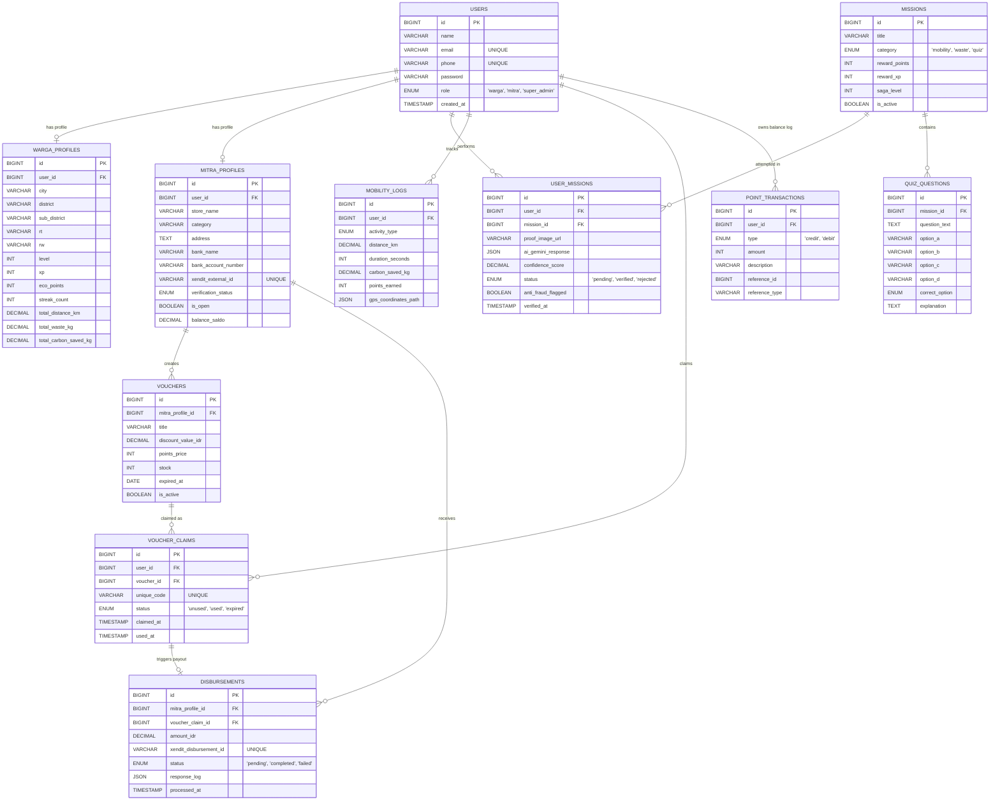

# Entity Relationship Diagram (ERD) - KarbonKita

Diagram ini menggunakan standar **Mermaid.js**. Anda dapat melihat diagram ini secara visual dengan menggunakan ekstensi Markdown Preview yang mendukung Mermaid di VSCode (seperti *Markdown Preview Mermaid Support*) atau dengan mem-paste kode di bawah ini ke [Mermaid Live Editor](https://mermaid.live).

